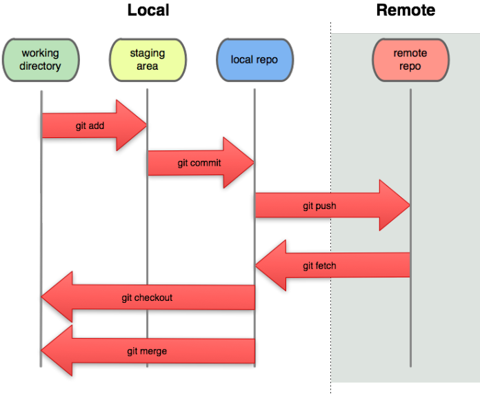

# git Basic Tutorials 

## 1. 깃(Git)이란 무엇인가?
- THE INFORMATION MANAGER FROM HELL
- 깃(git)은 소프트웨어 소스의 변화를 끊임없이 추적하는 버전 관리 툴의 일종 
- 기존의 중앙 저장소 개념을 탈피해서 독립적인 관리가 가능하다는 특징이 있는 버전 관리 툴이다. 
- 깃(Git)은 컴퓨터 파일의 변경사항을 추적하고 여러 명의 사용자들 간에 해당 파일들의 작업을 조율하기 위한 분산 버전 관리 시스템이다. 
[위키백과](https://ko.wikipedia.org/wiki/%EA%B9%83_(%EC%86%8C%ED%94%84%ED%8A%B8%EC%9B%A8%EC%96%B4))

## 2. git의 세가지 목적 
- 버전(Version)관리
    - 버전 관리란 소스의 특정 시점을 시간에 따라 기록 하는 것을 말한다.
    - 각각의 버전을 따라서 파일을 이전 상태로 돌릴 수 있으며, 프로젝트를 통째로 돌리는 것도 가능하다. 
    - 시간에 따른 수정(변화)를 비교할 수 있고, 누가 언제 수정을 했는지도 알 수 있다. 
    - git은 기존의 중앙 집중식 버전 관리에서 탈피해서 여러 개발자의 각자의 pc와 저장소에 분산해서 저장하는 방식
    - 버전의 복사본을 로컬에서 관리하는 방식이기 때문에 익히기는 어렵지만 훨씬 빠른 속도를 가지고 있다. 
- 백업(Backup)
    - 백업(backup)이란, 컴퓨터에 가진 정보가 유실될 것을 생각해서 다른 곳에 복사본을 저장해 놓는 작업
    - 각각의 pc에서 작업한 내용을 원격 저장소(remote repository)에 저장하거나(push) 각각의 pc로 가져오는(pull) 작업을 통해 git을 통한 백업을 수행할 수 있다.
- 협업(Collaborate)
    - 원격 저장소 (예)github)를 이용한 push/pull을 통해서 협업을 도움
    - git에서는 같은 버전의 소스가 작업될 때, 소스 덮어씌우기 같은 문제를 처리하면서 이른바 협업에서의 교통정리를 맡는다.

## 3. git CLI(Command Line Interface)
### git CLI를 쓰는 이유
    - 모든 git 기반의 프로그램들은 CLI를 기반으로 만들어져 있다. 
    - GUI 기반의 프로그램들을 사용할 수 없는 경우에도 CLI를 사용할 수가 있다.
    - 터미널에 명령어를 사용하므로써 동시적인 작업이 가능하며, 반복패턴의 자동화가 가능하다. 

### Working Tree / Staging Area / Repository / Remote Repository의 이해

- Working Tree (Working Directory)
    - 현재 작업하고 있는 상태 또는 공간을 말한다. 
    - 단순히 local repository를 뜻하는 것이 아니라 사용자가 작업하고 있는 상태를 말함.
- Staging Area
    - Working Tree에서 작업한 내용이 버전 관리가 들어가는 곳 
    - git add로 추가된 작업 내용은 이 시점부터 작업이 추적(tracking)된다
- Local Repository
    - 작업자의 개인 PC라고 보면됨. 
    - 버전 관리가 되어 추적되고 있던 소스코드들이 commit 명령을 통해서 버전이 되는 곳
- Remote Repository
    - github와 같이 원격 저장소를 뜻한다. 

### 1) git init
    - Initialize repository
    - 버전 관리가 필요한 폴더를 초기화 시키는 명령 
    - .git : git repository

### 2) git status
    - 작업하고 있는 working tree의 상태를 보여준다.
    - working tree status

### 3) git add 'filename'
    - working tree에서 작업하고 있는 file을 버전 관리를 하기 위해 Staging Area에 올린다. 
    - add to staging area
    - git add . 명령을 통해서 현재 디렉토리의 모든 소스를 Staging Area로 보낼 수 있다. 

### 4) git log
    - show version
    - 지금까지 버전의 history를 볼 수 있다.
    - 옵션들
    - git log --stat
    - git log -p
    
### 5) git commit
    - create version
    - Staging Area에 올라간 파일을 실제로 Local Repo로 올리면서 버전을 생성한다. 
    - git commit -m "~~~"
    - git commit -am "~~~"

### 6) git diff 
    - Show changes
    - 소스의 변경점을 볼 수 있다.

### 7) git checkout 'commit ID'
    - 해당 commit ID의 시점으로 돌아가는 명령

### 8) git reset 
    - git reset --hard 'commit ID' : 해당 commit ID의 시점으로 돌아가면서 현재 working tree의 내용은 물론 'commit ID'의 시점 이후의 모든 커밋을 삭제한다. 

